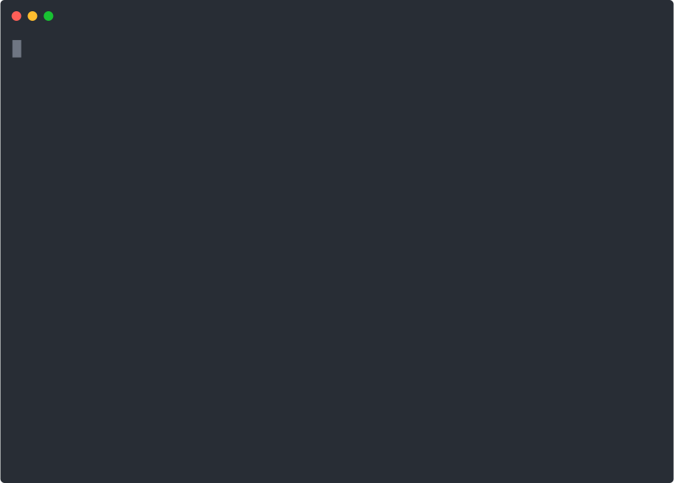

# 🐍 IP Fabric Logging

This project uses the default python logger and allows you to configure any custom logger using dictionary objects in ```log.py```
### Getting Started
```python-ipfabric/ipfabric/logg.py``` is the file that houses the configurations for logging throughout the project.

There are a few examples found in this directory that can be used to quickly set up common logging use cases. 

To use any of the preconfigured loggers replace ```python-ipfabric/ipfabric/logg.py``` with any of the logg files below.

#### Example

##### To Enable Json Logging
Ensure to Install Examples Extras via poetry 
```shell
pip install -U poetry 
```
```shell
poetry install -E examples
```

```shell
mv logg_json_file.py ../../ipfabric/logg.py
```


1. Enable Debugging - ``` logg_debug.py ```
2. Log to a file with JSON formatted Logs - ``` logg_file.py ```
3. Log to a file rotating on size/time with JSON formatted logs ``` logg_file_rotation.py ```

### Custom Logging

Editing ```logg.py``` allows you to set up any Handlers, Formatters, and Filters you may want to apply to the root logger or set up any custom loggers.

Examples of each can be found in the in-line comments inside ```logg.py```
Please follow the Python Logging Documentation found [here](https://docs.python.org/3/library/logging.config.html#dictionary-schema-details) for the dictionary schema
of each logging configuration item. 

#### Setting up file logging:

[](../img/logging.svg)